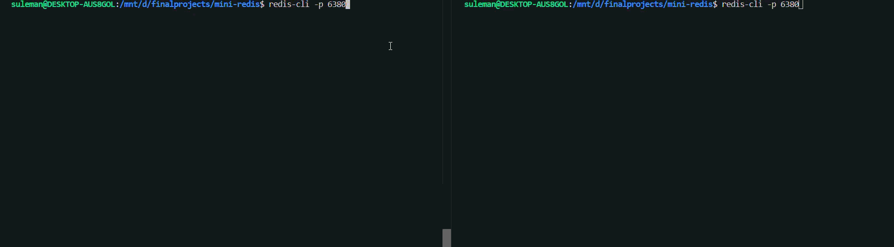
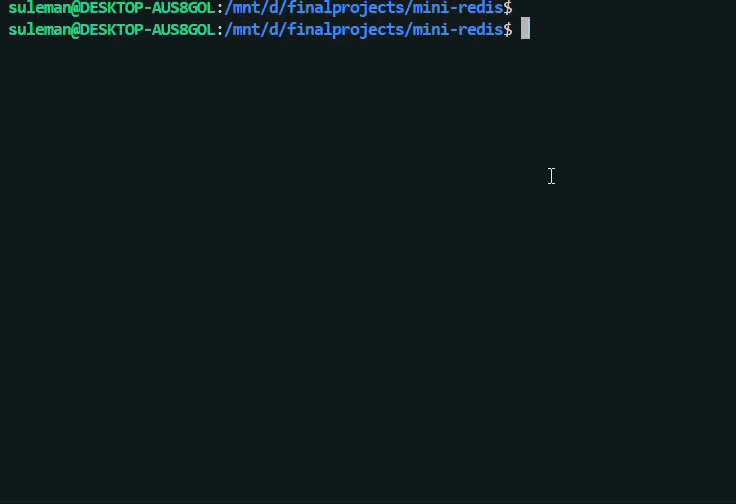

# mini-redis

An educational, from-scratch implementation of a Redis-compatible server in Java. Speaks the RESP protocol over TCP, works with the standard `redis-cli` client, and is built to learn the fundamentals of networking, protocol design, concurrency, persistence, and clean layered architecture.

> **Status:** Week 5 complete. Concurrent server with thread-pool client handling, thread-safe in-memory store, key expiration (lazy + active), and append-only persistence.

## Demo
### First Look


### Concurrency


### Sweeper


### Some SS


## What it does

- Listens on TCP port 6380 for client connections
- Speaks [RESP](https://redis.io/docs/latest/develop/reference/protocol-spec/) — the same wire protocol real Redis uses
- Works out of the box with the standard `redis-cli` client
- Handles multiple clients concurrently via a thread pool
- Stores key-value pairs in a thread-safe in-memory store
- Supports key expiration with lazy (on access) and active (background sweeper) strategies
- Persists data via an append-only log — survives server restarts
- Handles malformed input gracefully — never crashes on hostile bytes
- Graceful shutdown via JVM shutdown hooks

### Supported commands

| Command | Description | Example |
|---|---|---|
| `PING` | Health check | `PING` → `PONG` |
| `SET key value` | Store a value | `SET name alice` → `OK` |
| `SET key value EX seconds` | Store with TTL | `SET token abc EX 60` → `OK` |
| `GET key` | Retrieve a value | `GET name` → `"alice"` |
| `DEL key` | Delete a key | `DEL name` → `(integer) 1` |
| `EXISTS key` | Check if a key exists | `EXISTS name` → `(integer) 1` |
| `EXPIRE key seconds` | Set TTL on existing key | `EXPIRE name 30` → `(integer) 1` |
| `TTL key` | Get remaining TTL | `TTL name` → `(integer) 28` |
| `PERSIST key` | Remove TTL from a key | `PERSIST name` → `(integer) 1` |

## Quick start

**Prerequisites:** Java 21+, `redis-cli` installed.

Clone and run:

```bash
git clone https://github.com/suleman-muhammad/mini-redis.git
cd mini-redis
./gradlew run
```

You should see:

```
Server: Ready and Running on Port: 6380
```

In another terminal:

```bash
redis-cli -p 6380
127.0.0.1:6380> PING
PONG
127.0.0.1:6380> SET name alice
OK
127.0.0.1:6380> GET name
"alice"
127.0.0.1:6380> SET session token123 EX 5
OK
127.0.0.1:6380> TTL session
(integer) 5
127.0.0.1:6380> GET session
"token123"
... (wait 5 seconds) ...
127.0.0.1:6380> GET session
(nil)
127.0.0.1:6380> TTL session
(integer) -2
```

Kill the server, restart it, and your data is still there — the append-only log replays on startup.

## Architecture

The project is organized into layered packages, each with a single responsibility:

```
com.miniredis/
├── Main.java              ← entry point (wires everything together)
├── server/
│   ├── Server.java        ← accept loop, thread pool, shutdown hooks
│   └── ClientHandler.java ← handles one client's lifecycle
├── resp/
│   ├── RespReader.java    ← bytes → List<String> (parses commands)
│   ├── RespWriter.java    ← Response → bytes (formats replies)
│   └── Response.java + subclasses (SimpleString, BulkString, etc.)
├── commands/
│   └── CommandRouter.java ← dispatches parsed commands to handlers
├── data/
│   ├── Store.java         ← thread-safe in-memory store with expiry
│   └── Value.java         ← immutable wrapper: value + expiration time
├── persistence/
│   └── AofWriter.java     ← append-only log: write, replay, close
└── exceptions/
    └── ProtocolException.java
```

**Dependency flow:**

```
Main → Server → CommandRouter → Store
                 ↘       ↓    ↗
              RespReader  AofWriter
              RespWriter
```

Each layer depends only on layers "below" it. `Store` knows nothing about RESP or sockets. `RespReader` knows nothing about commands. `AofWriter` knows nothing about networking. This means each concern can be modified independently.

## Design decisions worth calling out

**Byte-level parsing instead of `readLine()`.**
RESP bulk strings can contain arbitrary bytes including `\r\n`, so line-based parsing corrupts binary data. The parser reads raw bytes via `DataInputStream` and consumes exactly the number of bytes each length prefix declares.

**Typed `Response` hierarchy instead of raw RESP strings from handlers.**
Command handlers return a `Response` object (`SimpleString`, `BulkString`, `NullString`, `RespInteger`, `ErrorString`). The `RespWriter` serializes these to bytes. Handler code expresses *what a response is*, not *how it's formatted on the wire* — so switching to RESP3 or another protocol would only touch the writer.

**Immutable `Value` records for thread safety.**
Each stored entry is a `Value(String val, long expiresAtMillis)` — immutable and final. Updates construct a new `Value` and atomically swap it into the `ConcurrentHashMap`. No per-key locks, no mutable shared state. Thread safety comes from immutability + atomic operations, not from locking.

**Dual expiration strategy.**
Lazy expiration checks TTL on every key access — expired keys are removed atomically via `computeIfPresent`. Active expiration runs a background `ScheduledExecutorService` that sweeps the store every second, removing any expired keys that haven't been accessed. Both strategies together prevent stale keys from leaking memory while keeping per-request overhead minimal.

**Thread pool instead of thread-per-client.**
An `ExecutorService` with a fixed thread pool handles client connections. Pool size is derived from `Runtime.getRuntime().availableProcessors()`. Bounded concurrency prevents resource exhaustion under load while still serving many clients in parallel.

**Atomic store operations via `ConcurrentHashMap.computeIfPresent`.**
Race conditions between "check if key exists" and "modify key" are eliminated by pushing multi-step logic into single atomic lambdas. No external synchronization needed.

**Append-only persistence.**
Every successful write command (`SET`, `DEL`, `EXPIRE`, `PERSIST`) is appended to a log file on disk. On startup, the log is replayed through the `CommandRouter` to rebuild the store — same code path as live commands, no special restore logic. The AOF writer is `synchronized` to handle concurrent writes from multiple client threads safely.

**Dependency injection over singletons.**
`CommandRouter`, `Store`, `AofWriter`, and other services are wired together in `Main.main()` and passed to their consumers via constructors. No hidden globals. Makes the code testable, and dependencies are visible in constructor signatures.

**Fail-fast on malformed input.**
The parser enforces size limits (512MB max bulk string, 1M max array elements) to prevent DOS via oversized allocations, validates every byte position, and throws `ProtocolException` on any deviation from spec. The client handler catches this, replies with `-ERR ...`, and closes that connection — but the server keeps running.

**Graceful shutdown.**
A JVM shutdown hook orchestrates cleanup: the client thread pool is shut down gracefully (with a forced fallback after timeout), the expiry sweeper is stopped, and the AOF writer is flushed and closed. In-flight commands finish before the server exits.

## Known limitations and future improvements

- **AOF log compaction.** The log grows indefinitely — repeated `SET`/`DEL` on the same key produces redundant entries. A future improvement would periodically rewrite the log with only the current state, similar to Redis's `BGREWRITEAOF`.
- **Expired keys in AOF replay.** Keys logged with relative TTLs (`EX 5`) get a fresh TTL on replay. A cleaner approach would convert to absolute timestamps (`EXPIREAT`, `PXAT`) before logging, so expired keys stay dead after restart. The infrastructure for `EXPIREAT` and `SET ... PXAT` is a small addition.
- **`redis-benchmark` compatibility.** The server works correctly with `redis-cli` but has a known issue with `redis-benchmark` — likely caused by `CONFIG` or `HELLO` command errors closing connections. Investigating whether command errors incorrectly trigger disconnection.
- **Values containing spaces.** The AOF text format uses space-separated tokens. Values with embedded spaces would be split incorrectly on replay. A future fix would use RESP format in the log or implement quoting/escaping.
- **Additional commands.** Real Redis supports ~200 commands. Natural next additions would be `INCR`/`DECR`, `MGET`/`MSET`, `KEYS`, `APPEND`, `STRLEN`, and list operations (`LPUSH`, `RPUSH`, `LRANGE`).
- **Single-threaded event loop.** Real Redis uses a single-threaded event loop with non-blocking I/O (epoll/kqueue), not a thread pool. Rewriting the concurrency model to use Java NIO `Selector` would be a genuinely advanced stretch goal.
- **Unit tests.** The RESP parser, command router, and store are all designed as testable pure-function-style code. A test suite with crafted byte inputs for the parser and concurrent stress tests for the store would strengthen the project.

## What I learned building this

- **TCP fundamentals** — sockets, blocking I/O, connection lifecycle, graceful vs. abrupt disconnect.
- **Protocol design and parsing** — why length-prefixing beats delimiters for binary-safe protocols, the discipline of "byte position ownership" when writing parsers.
- **Layered architecture** — separating storage, protocol, transport, and business logic into packages with acyclic dependencies. Feeling the payoff when a refactor touches one file instead of many.
- **Java I/O internals** — the difference between `InputStream`, `Reader`, `BufferedReader`, and `DataInputStream`, and when to use each.
- **Concurrency** — thread pools via `ExecutorService`, thread-safe data structures via `ConcurrentHashMap`, atomic check-then-act patterns with `computeIfPresent`, and why immutable values eliminate whole categories of race conditions.
- **Time-based systems** — representing TTL as absolute epoch deadlines, lazy vs. active expiration tradeoffs, `ScheduledExecutorService` for background tasks, and the subtle gotcha that a scheduled task silently stops if it throws an uncaught exception.
- **Persistence** — append-only logging, the tradeoff between log-after-success (tiny durability gap) vs. write-ahead logging (complex rollback), replay-based recovery, and why the AOF writer must be synchronized under concurrent access.
- **Defensive parsing** — never trust bytes from the network. Sanity-limit every declared length. Throw on any deviation, with error messages that name what was expected and what arrived.
- **Debugging methodology** — reading stack traces top-down, printing bytes in hex when protocol-level things break, using `nc` as a "man-in-the-middle" to see what real clients send.

## Building from source

```bash
./gradlew build       # compile everything
./gradlew run         # start the server
./gradlew test        # run tests
```

Requires JDK 21 or later.

## References

- [Redis RESP protocol specification](https://redis.io/docs/latest/develop/reference/protocol-spec/)
- [Redis commands reference](https://redis.io/commands/) — for matching real Redis's response formats

---

Built as a learning project. Not intended as a production Redis alternative.