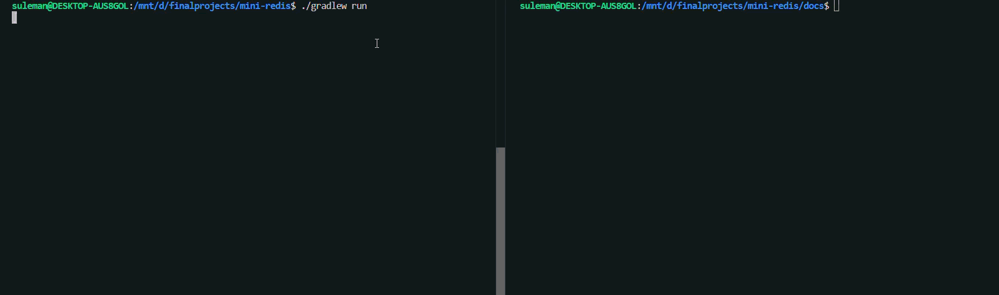
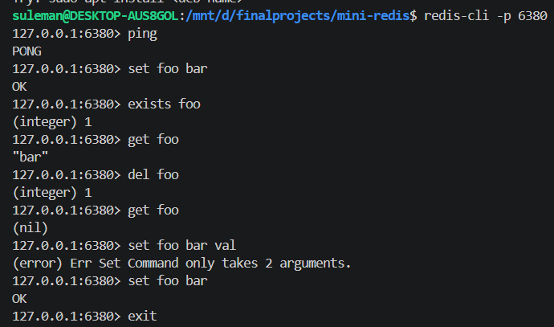
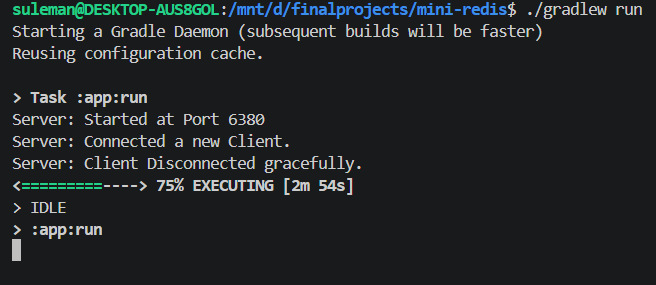

# mini-redis

An educational, from-scratch implementation of a Redis-compatible server in Java. Speaks the RESP protocol over TCP, works with the standard `redis-cli` client, and is built to learn the fundamentals of networking, protocol design, and clean layered architecture.

> **Status:** Week 2 complete. Server handles one client at a time. Concurrency (thread-pool per client) is next.

## Demo






## What it does

- Listens on TCP port 6380 for client connections
- Speaks [RESP](https://redis.io/docs/latest/develop/reference/protocol-spec/) — the same wire protocol real Redis uses
- Works out of the box with the standard `redis-cli` client
- Stores key-value pairs in memory
- Handles malformed input gracefully — never crashes on hostile bytes

### Supported commands

| Command | Description | Example |
|---|---|---|
| `PING` | Health check | `PING` → `PONG` |
| `SET key value` | Store a value | `SET name alice` → `OK` |
| `GET key` | Retrieve a value | `GET name` → `"alice"` |
| `DEL key` | Delete a key | `DEL name` → `(integer) 1` |
| `EXISTS key` | Check if a key exists | `EXISTS name` → `(integer) 0` |

## Quick start

**Prerequisites:** Java 21+, `redis-cli` installed.

Clone and run:

```bash
git clone https://github.com/suleman-muhammad/mini-redis.git
cd mini-redis
./gradlew run
```

You should see:

```
Server: Ready and Running on Port: 6380
```

In another terminal:

```bash
redis-cli -p 6380
127.0.0.1:6380> PING
PONG
127.0.0.1:6380> SET name alice
OK
127.0.0.1:6380> GET name
"alice"
127.0.0.1:6380> EXISTS name
(integer) 1
127.0.0.1:6380> DEL name
(integer) 1
127.0.0.1:6380> GET name
(nil)
```

## Architecture

The project is organized into layered packages, each with a single responsibility:

```
com.miniredis/
├── Main.java        ← entry point (wires everything together)
├── server/
│   ├── Server.java       ← accept loop, owns the ServerSocket
│   └── ClientHandler.java ← handles one client's lifecycle
├── resp/
│   ├── RespReader.java   ← bytes → List<String> (parses commands)
│   ├── RespWriter.java   ← Response → bytes (formats replies)
│   └── Response.java + subclasses (SimpleString, BulkString, etc.)
├── commands/
│   └── CommandRouter.java ← dispatches parsed commands to handlers
├── data/
│   └── Store.java        ← in-memory key-value store
└── exceptions/
    └── ProtocolException.java
```

**Dependency flow:**

```
Main → Server → CommandRouter → Store
                 ↘             ↗
                    RespReader/RespWriter
```

Each layer depends only on layers "below" it. `Store` knows nothing about RESP or sockets. `RespReader` knows nothing about commands. This means adding new commands (Week 4) or persistence (Week 5) touches one file, not the whole codebase.

## RESP protocol — a quick reference

Every command from a client is a RESP array of bulk strings. For example, `SET foo bar` travels on the wire as:

```
*3\r\n$3\r\nSET\r\n$3\r\nfoo\r\n$3\r\nbar\r\n
```

The server replies using one of five RESP types:

| Prefix | Type | Example use |
|---|---|---|
| `+` | Simple string | `+OK\r\n` |
| `-` | Error | `-ERR unknown command 'FOO'\r\n` |
| `:` | Integer | `:1\r\n` (from `DEL`, `EXISTS`) |
| `$` | Bulk string | `$3\r\nbar\r\n` (from `GET`) |
| `$-1` | Null bulk | `$-1\r\n` (missing key from `GET`) |

## Design decisions worth calling out

**Byte-level parsing instead of `readLine()`.**
RESP bulk strings can contain arbitrary bytes including `\r\n`, so line-based parsing corrupts binary data. The parser reads raw bytes via `DataInputStream` and consumes exactly the number of bytes each length prefix declares.

**Typed `Response` hierarchy instead of raw RESP strings from handlers.**
Command handlers return a `Response` object (`SimpleString`, `BulkString`, `NullString`, `IntegerReply`, `ErrorString`). The `RespWriter` serializes these to bytes. Handler code expresses *what a response is*, not *how it's formatted on the wire* — so switching to RESP3 or another protocol would only touch the writer.

**Dependency injection over singletons.**
`CommandRouter`, `Store`, and other services are wired together in `MiniRedis.main()` and passed to their consumers via constructors. No hidden globals. Makes the code testable, and dependencies are visible in constructor signatures.

**Fail-fast on malformed input.**
The parser enforces size limits (512MB max bulk string, 1M max array elements) to prevent DOS via oversized allocations, validates every byte position, and throws `ProtocolException` on any deviation from spec. The client handler catches this, replies with `-ERR ...`, and closes that connection — but the server keeps running.

**One `ClientHandler` per client.**
Each accepted connection gets a fresh handler with its own reader, writer, and socket. No per-client state on shared objects. This will pay off in Week 3 when the same handler is submitted to a thread pool instead of run inline.

## What's next

- **Week 3:** Concurrency. Introduce a thread pool so multiple clients can be served simultaneously. Switch `Store` to `ConcurrentHashMap`. Benchmark with `redis-benchmark`.
- **Week 4:** Key expiration. `EXPIRE`, `TTL`, `EXPIREAT`. Both lazy (checked on access) and active (background sweeper) strategies.
- **Week 5:** Persistence. Append-only log so data survives a restart.
- **Week 6:** Tests, benchmarks, polish, final README.

## What I learned building this

- **TCP fundamentals** — sockets, blocking I/O, connection lifecycle, graceful vs. abrupt disconnect.
- **Protocol design and parsing** — why length-prefixing beats delimiters for binary-safe protocols, the discipline of "byte position ownership" when writing parsers.
- **Layered architecture** — separating storage, protocol, transport, and business logic into packages with acyclic dependencies. Feeling the payoff when a refactor touches one file instead of many.
- **Java I/O internals** — the difference between `InputStream`, `Reader`, `BufferedReader`, and `DataInputStream`, and when to use each.
- **Defensive parsing** — never trust bytes from the network. Sanity-limit every declared length. Throw on any deviation, with error messages that name what was expected and what arrived.
- **Debugging methodology** — reading stack traces top-down, printing bytes in hex when protocol-level things break, using `nc` as a "man-in-the-middle" to see what real clients send.

## Building from source

```bash
./gradlew build       # compile everything
./gradlew run         # start the server
./gradlew test        # run tests (parser test suite coming Week 3)
```

Requires JDK 21 or later.

## References

- [Redis RESP protocol specification](https://redis.io/docs/latest/develop/reference/protocol-spec/)
- [Redis commands reference](https://redis.io/commands/) — for matching real Redis's response formats

---

Built as a learning project. Not intended as a production Redis alternative.