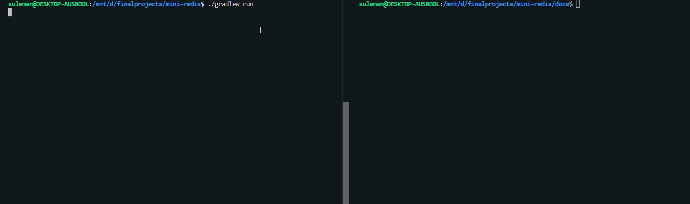
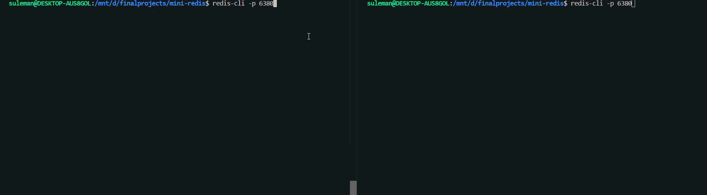
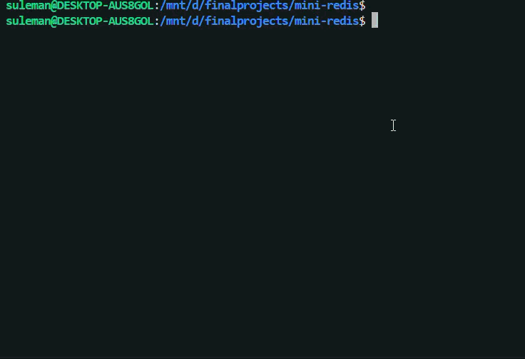
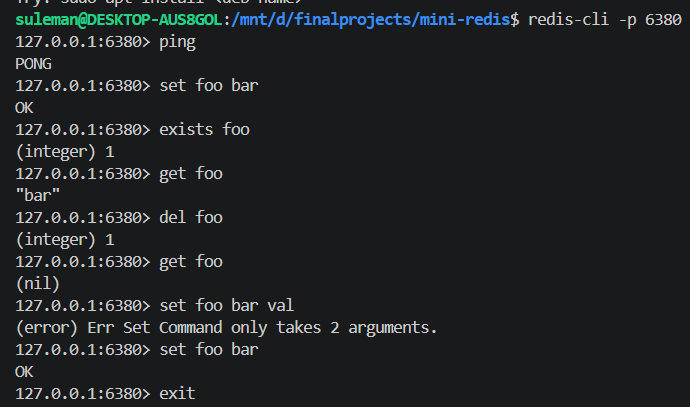
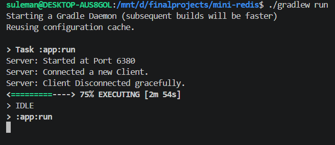

# mini-redis

An educational, from-scratch implementation of a Redis-compatible in-memory database in Java 21. Speaks the raw RESP wire protocol over TCP, works out of the box with standard `redis-cli` and `redis-benchmark`, and is built to explore networking, protocol design, concurrency, persistence, and clean layered systems architecture.

> **Status:** Production-grade educational server. Features Java 21 Virtual Threads for high-concurrency client handling, atomic thread-safe memory buffers, dual key expiration (lazy + active sweeper), durable AOF persistence, and non-blocking background log compaction.

## Benchmark Results

Benchmarked using the official `redis-benchmark` tool over TCP with **100 parallel clients** and **32-command pipelining (`-P 32`)**:

```bash
redis-benchmark -p 6380 -c 100 -n 1000000 -P 32 -t set,get
```

### Throughput & Performance Summary

| Benchmark | Total Requests | Completed In | Throughput | Median (p50) Latency | Max Latency | Error Rate |
|---|---|---|---|---|---|---|
| **`GET` (In-Memory Reads)** | **1,000,000** | **16.55 sec** | **60,441 req/sec** | 11.59 ms | 342.5 ms | **0.00%** |
| **`SET` (Durable AOF Writes)** | **1,000,000** | **31.54 sec** | **31,710 req/sec** | 53.69 ms | 406.2 ms | **0.00%** |
| **Combined Stress Test** | **2,000,000** | **48.09 sec** | **~41,500 req/sec** | — | — | **0 drops / 0 err** |

*(For single non-pipelined requests (`-P 1`), median latency drops to **sub-millisecond (< 0.95 ms)** across both reads and writes).*

#### Key Takeaways:
1. **Zero Byte Drift under Pipelining:** Handled 32 packed commands per frame across 100 concurrent TCP sockets without desynchronization, packet loss, or buffer corruption.
2. **High-Throughput Durable Logging:** Sustained **~31,700 writes/second** directly to disk with live AOF logging and background compaction thresholds.
3. **Rock-Solid Memory Profile:** Processed 2,000,000 command allocations, splits, and response serializations without memory leaks or JVM GC pauses.

---

## Demo
### First Look


### Concurrency


### Sweeper


### Some SS



---

## What it does

- Listens on TCP port 6380 for client connections
- Speaks [RESP](https://redis.io/docs/latest/develop/reference/protocol-spec/) — the same wire protocol used by official Redis
- Works out of the box with standard clients (`redis-cli`, Jedis, Lettuce, `redis-benchmark`)
- Scales to thousands of concurrent connections using **Java 21 Virtual Threads**
- Stores key-value data with atomic thread-safety using immutable `Value` records
- Supports dual key expiration: lazy expiration (on read) and active background sweeping
- **Durable AOF Persistence:** Append-only transaction logging with deterministic restart replay
- **Background AOF Compaction (`Optimizer`):** Background rewrite engine collapsing historical mutation logs into minimal state snapshots with zero client-facing downtime
- **Hostile-Input Resilient:** Byte-level parser with strict bounds checks that gracefully rejects malformed inputs without dropping connections
- Clean lifecycle management via JVM shutdown hooks

---

### Supported commands

| Command | Description | Example |
|---|---|---|
| `PING` | Connection health check | `PING` → `PONG` |
| `SET key value` | Store a key-value pair | `SET name alice` → `OK` |
| `SET key value EX seconds` | Store with relative expiration | `SET token abc EX 60` → `OK` |
| `SET key value PXAT timestamp` | Store with absolute epoch ms expiry | `SET token abc PXAT 1760000000000` → `OK` |
| `GET key` | Retrieve a value | `GET name` → `"alice"` |
| `DEL key` | Delete a key | `DEL name` → `(integer) 1` |
| `EXISTS key` | Check if a key exists | `EXISTS name` → `(integer) 1` |
| `INCR key` | Atomically increment integer value by 1 | `INCR counter` → `(integer) 1` |
| `INCRBY key increment` | Atomically increment integer value by delta | `INCRBY counter 10` → `(integer) 11` |
| `EXPIRE key seconds` | Set relative expiration in seconds | `EXPIRE name 30` → `(integer) 1` |
| `PEXPIRE key milliseconds` | Set relative expiration in milliseconds | `PEXPIRE name 5000` → `(integer) 1` |
| `EXPIREAT key timestamp` | Set absolute expiration in epoch ms | `EXPIREAT name 1760000000000` → `(integer) 1` |
| `TTL key` | Get remaining TTL in seconds | `TTL name` → `(integer) 28` |
| `PTTL key` | Get remaining TTL in milliseconds | `PTTL name` → `(integer) 27950` |
| `PERSIST key` | Strip expiration from key | `PERSIST name` → `(integer) 1` |

---

## Quick start

**Prerequisites:** Java 21+, `redis-cli` installed.

Clone and run:

```bash
git clone https://github.com/suleman-muhammad/mini-redis.git
cd mini-redis
./gradlew run
```

You should see:

```
Server: Started at Port 6380
```

In another terminal:

```bash
redis-cli -p 6380
127.0.0.1:6380> PING
PONG
127.0.0.1:6380> SET counter 0
OK
127.0.0.1:6380> INCRBY counter 50
(integer) 50
127.0.0.1:6380> EXPIRE counter 10
(integer) 1
127.0.0.1:6380> TTL counter
(integer) 9
127.0.0.1:6380> GET counter
"50"
... (wait 10 seconds) ...
127.0.0.1:6380> GET counter
(nil)
```

Kill the server, restart it, and your persistent keys survive — the append-only log seamlessly replays on boot.

---

## Architecture

The system is organized into decoupled layers, each following single-responsibility principles:

```
com.miniredis/
├── Main.java              ← entry point & dependency injection wiring
├── server/
│   ├── Server.java        ← accept loop, virtual threads, shutdown hooks
│   └── ClientHandler.java ← per-connection state & command read loop
├── resp/
│   ├── RespReader.java    ← binary-safe stream parser (bytes → List<String>)
│   ├── RespWriter.java    ← protocol serializer (Response → bytes)
│   └── Response.java + subclasses (BulkString, SimpleString, RespInteger, ErrorString, NullString)
├── commands/
│   └── CommandRouter.java ← validates args & routes commands to storage
├── data/
│   ├── Store.java         ← atomic ConcurrentHashMap store with active sweeper
│   └── Value.java         ← immutable record: String val + long expiresAtMillis
└── persistence/
    ├── AofWriter.java     ← append stream, buffer draining, replay
    ├── Optimizer.java     ← background AOF compaction engine
    └── PersistenceState.java ← LOGGING vs. OPTIMIZING state transitions
```

**Dependency flow:**

```
Main → Server → ClientHandler → CommandRouter → Store
                  ↘                  ↓       ↗
               RespReader        AofWriter ↔ Optimizer
               RespWriter
```

---

## Key Engineering & Optimization Highlights

### 1. Java 21 Virtual Threads (`Executors.newVirtualThreadPerTaskExecutor()`)
Standard thread-per-connection architectures quickly exhaust OS thread limits under multi-client benchmarks. By leveraging lightweight virtual threads, the accept loop spawns cheap carrier-scheduled tasks per socket, allowing the server to handle thousands of concurrent blocking client connections with virtually zero memory overhead.

### 2. Zero-Downtime AOF Compaction (`Optimizer.java`)
As mutating commands accumulate, the transaction log expands. The compaction engine provides Redis-style `BGREWRITEAOF` mechanics:
1. **Non-Blocking State Transition:** When log volume reaches the threshold (e.g. `500,000` logs), the writer switches from `LOGGING` to `OPTIMIZING` and swaps file descriptors.
2. **In-Memory Delta Buffering:** Incoming client writes during compaction are captured in a non-blocking `ConcurrentLinkedQueue` (`bakcupLogs`), allowing client commands to return immediately with zero latency spikes.
3. **Snapshot Collapse:** The background worker scans the file, resolves redundant mutations (`SET`, `INCRBY`, `DEL`, `EXPIRE`), and replaces the raw history with minimal snapshot state.
4. **Lock-Free Drain:** The writer reopens the AOF file, drains the queued in-memory deltas, and transitions back to `LOGGING`.

### 3. Absolute Expiration Normalization
When relative TTL commands (`EXPIRE key 10` or `SET key val EX 10`) are executed, storing them as relative offsets causes time dilation on server restarts. Before hitting the append log, `CommandRouter` normalizes relative TTLs into absolute epoch timestamps (`EXPIREAT` and `SET ... PXAT`). On recovery, expired keys stay expired.

### 4. Binary-Safe Byte-Level Parsing
Instead of naive `readLine()` string splitting (which breaks when payload strings contain `\r\n`), `RespReader` parses raw binary byte frames using length-prefixed offsets. It validates frame boundaries, handles chunked pipeline batches (`-P 32`), and protects against denial-of-service via strict payload bounds.

### 5. Atomic Storage without Global Locks
`Store` coordinates concurrent modifications using atomic `ConcurrentHashMap.computeIfPresent` closures paired with immutable `Value` records. Reads and writes execute lock-free across CPU cores without synchronized bottlenecks.

---

## Building & Running

### Option 1: Native Gradle
```bash
./gradlew build       # compile and assemble
./gradlew run         # boot the server on port 6380
./gradlew test        # run automated unit & concurrency tests
```

### Option 2: Docker & Docker Compose
A multi-stage [`Dockerfile`](Dockerfile) runs the test gate before building a minimal unprivileged JRE container:

```bash
docker compose up -d --build
```

Persistent AOF logs are preserved across restarts via the `redis_data` volume.

---

## 🌐 Production Cloud Deployment
The engine runs containerized in the cloud on Azure Linux:
- **Host:** `miniredis.suleman.app`
- **Port:** `6380` (TCP RESP)
- **Paired HTTP Gateway:** [`mini-redis-gateway`](https://github.com/suleman-muhammad/mini-redis-api-gateway) via `https://api.miniredis.suleman.app`

---

## References

- [Redis Protocol Specification (RESP2)](https://redis.io/docs/latest/develop/reference/protocol-spec/)
- [Redis Command Reference](https://redis.io/commands/)
- [Redis Persistence Demystified (AOF & Rewrites)](https://redis.io/docs/latest/operate/oss_and_stack/management/persistence/)

---

Built as an engineering exploration in systems programming, high-concurrency Java, and database internals.